# Solución reto semana 03

## Ejercicio

- Tomar tu proyecto roxs-voting-app
- Crear los workflows de CI/CD completos
- Configurar self-hosted runner para deployment
- Probar el pipeline completo desde commit hasta producción

## Tareas Adicionales (Opcionales)
- Crear scripts de utilidad para deployment local
- Implementar sistema de backup para PostgreSQL
- Configurar alertas por email o Slack
- Crear documentación completa del proyecto

## Flujo CI/CD
```
1. 👨‍💻 Developer hace push a 'develop'
   ↓
2. 🔄 GitHub Actions ejecuta CI
   - Tests de vote (Python)
   - Tests de result (Node.js) 
   - Tests de worker (Node.js)
   - Integration tests con Docker Compose
   ↓
3. 🏗️ Build de imágenes Docker
   - vote:latest
   - result:latest
   - worker:latest
   ↓
4. 🚀 Auto-deploy a Staging
   - Self-hosted runner ejecuta deployment
   - Health checks verifican que funciona
   - Smoke tests confirman funcionalidad
   ↓
5. 👨‍💻 Developer hace PR a 'main'
   ↓
6. 👀 Code review y merge
   ↓
7. 🎯 Deploy a Production (con approval manual)
   - Backup de base de datos
   - Self-hosted runner ejecuta deployment
   - Health checks verifican que funciona
   - Notificación de deployment exitoso
   ↓
8. 📊 Monitoreo continuo
   - Health checks cada 30 minutos
   - Alertas automáticas si algo falla
```

## 1. Analisis de la solución

Teniendo en cuenta los retos 01 y 02, seguimos acumulando conceptos como la creación de maquinas virtuales como self-hosted runners y despliegue pero ahora en dos ambientes, uno **staging** y otro **production** además que la preparación de pipelines para automatizar algunas de las tareas que hemos realizado en ejercicios anteriores

## 1.2 Puedes ver la solución de la semana 01 [aquí](../01-automatizacion-con-vagrant-y-ansible/README.md) y la semana 02 [aquí](../02-docker-y-compose/README.md)

### 1.2.1 ¿Cómo vamos a trasladar lo aprendido en la semana 01 y 02 a Self-hosted runners y pipelines?

Bastante sencillo, sabemos que los runnes son maquinas virtuales y tenemos que entender el flujo de despliegue como lo hicimos en la semana 01, tenemos el despliegue listo en la semana 02 con docker y compose, lo que con solo tener instalado en las maquinas virtuales ya podemos completar todo

Ahora **¿Qué son los ambientes staging y production?** Puedes pensarlo como dos espacios con propositos diferentes, en las aplicaciones reales no manejamos las nuevas funciones y arreglos directamente en producción, no sabemos si vamos a tumbar la aplicación por completo, así que vamos a dedicar el ambiente staging para hacer pruebas y luego de confirmar que todo esté bien, vamos a llevarlos a producción

```
Hacemos cambios en staging -> hacemos un pull request a master
```

Ahora conocemos el flujo que vamos a llevar para los dos ambientes, piensa que los pipelines son automatizaciones de cómo se hace el despliegue, pero es básicamente lo que hicimos en los ejercicios anteriores

**¿Cómo vamos a visualizar los ambientes?**
Parece una tarea compleja teniendo en cuenta que tenemos dos maquinas virtuales, pero la respuesta está en la redirección de puertos

### 2. Definiendo Vagrantfile

Cada vez que ejecutamos un comando de Vagrant, automaticamente lee el Vagrantfile que tenemos en nuestro root, pero ese lo dedicaremos completamente para el reto de la semana 01, vamos a crear uno nuevo y vamos a ser especificos con Vagrant para que ejecute este nuevo Vagrantfile

La arquitectura será la siguiente:

```
// Staging
80 -> 7999 # Vote
3000 -> 8000 # Worker
3001 -> 8001 # Result

// Production
80 -> 6999 # Vote
3000 -> 7000 # Worker
3001 -> 7001 # Result
```

Hay que tener en cuenta eso para saber a qué ambiente pertenece cada puerto, pero al final lo vamos a poder ver nuestro navegador

Puedes ver archivo [Vagrantfile.runners](../../Vagrantfile.runners)

ahora vamos a preparar un `script` que haga todo el setup (instalación, preparación y conexión con GitHub)

Puedes verlo [aquí](../../scripts/setup_selfhosted_runner.sh)

### Explicación del script de instalación y configuración de un self-hosted runner en Bash

Este script automatiza la instalación y configuración de un **GitHub Actions self-hosted runner** sobre una máquina Linux (en el ejemplo, un entorno Vagrant). El objetivo es dejar el runner preparado, configurado y ejecutándose como un servicio de sistema, incluyendo la instalación automática de Docker y todas las dependencias necesarias.

### Pasos que realiza el script

1. **Fallo temprano en caso de error**
   - `set -e`: Si cualquier comando falla, el script termina de inmediato para evitar estados inconsistentes.

2. **Parámetros de entrada**
   - El script espera exactamente 3 parámetros: 
     - URL del repositorio (`repo_url`)
     - Token de registro del runner (`runner_token`)
     - Etiqueta personalizada para el runner (`runner_label`)
   - Si no se reciben, muestra el uso correcto y sale.

3. **Variables principales**
   - Define variables para los argumentos y configura rutas y nombres fijos:
     - `RUNNER_USER` por defecto es `vagrant`
     - `RUNNER_DIR` es el directorio donde se instalará el runner

4. **Instalación de dependencias**
   - Actualiza el sistema e instala `curl` y `jq` (para manipulación de JSON desde bash).

5. **Instalación de Docker (si no está presente)**
   - Si Docker no existe, descarga el instalador oficial de Docker y lo instala.
   - Añade el usuario `${RUNNER_USER}` al grupo `docker` para que no requiera `sudo`.
   - Limpia el archivo de instalación temporal.

6. **Creación del directorio del runner**
   - Asegura que el directorio del runner existe, creándolo como el usuario correspondiente.

7. **Descarga y descompresión del runner**
   - Obtiene la última versión disponible del runner oficial usando la API de GitHub y `jq`.
   - Descarga y descomprime el paquete, asignando sus archivos al usuario que lo operará.
   - Omitirá este paso si ya existe el archivo descargado (evita trabajo redundante).

8. **Configuración del runner**
   - Ejecuta el script `config.sh` de GitHub Actions para registrar el runner con el repo, token y etiqueta dados.
   - Usa el modo desatendido para automatizar la configuración.
   - Se ejecuta como el usuario de aplicación, no como root.

9. **Instalación y arranque como servicio**
   - Instala el runner como un servicio del sistema operativo usando `svc.sh`.
   - Inicia el servicio, asegurando que el runner quede siempre activo tras reinicios del sistema.

10. **Mensaje final**
    - Informa que el runner quedó configurado y corriendo.

---

### Ejemplo de uso

```sh
# Dentro de la maquina virtual - Llamado (Repositorio, token y etiqueta del runner)
./setup_selfhosted_runner.sh https://github.com/j-o-devsigner/Roxs-DevOps-Challenges TOKEN_AQUÍ staging
```

**¿Por qué de esta manera?** Principalmente para centralizar el setup y que no tengamos que hacer lo mismo dos veces, ahora bien... Lo tenemos que ejecutar manual porque es buena práctica no guardar el **TOKEN** en ningún sitio de la maquina virtual

### Preparación GitHub

Vas a ir a la configuración de tu repositorio, luego a `Actions` y luego `runners`, vas a darle en `new self-hosted runner` y va a generar una serie de pasos de instalación, de todo esto solo nos interesa la parte de `Configure` que se ve algo así:

```sh
# Create the runner and start the configuration experience
$ ./config.cmd --url https://github.com/j-o-devsigner/Roxs-DevOps-Challenges --token AQUÍ_TU_TOKEN# Run it!
```

lo que más nos interesa son la `url` y `token` ya que los necesita el script

### Lanzando las maquinas virtuales (self-hosted runners)

Ahora vamos a crear los self-hosted runners, ahora que tenemos el primer token a la mano lo que haremos es crear el de staging, recuerda que en el **Vagrantfile.runners** definimos dos maquinas virtuales con los siguientes nombres

```ruby
config.vm.define "staging-runner" do |prod|
config.vm.define "prod-runner" do |prod|
```

Y para **Vagrant** nos debemos dirigir así a ellos, ahora vamos a crearlos

```sh
# Staging
VAGRANT_VAGRANTFILE="Vagrantfile.runners" vagrant up staging-runner

# Prod
VAGRANT_VAGRANTFILE="Vagrantfile.runners" vagrant up prod-runner
```

En el proceso de creación de las maquinas virtuales puedes ver cómo se redireccionan los puertos y cómo se comparte la carpeta de nuestro proyecto con `/vagrant`

```sh
staging-runner: 80 (guest) => 7999 (host) (adapter 1)
staging-runner: 3000 (guest) => 8000 (host) (adapter 1)
staging-runner: 3001 (guest) => 8001 (host) (adapter 1)

staging-runner: ../roxs-voting-app => /vagrant
```

Una vez creada entramos a la maquina virtual

```bash
# Staging
VAGRANT_VAGRANTFILE="Vagrantfile.runners" vagrant ssh staging-runner
````

Lo que harás es ir directamente a `/vagrant`

```bash
# Comprobamos la sincronización
vagrant@staging-runner:/vagrant$ ls
README.md  Vagrantfile  Vagrantfile.runners  app  docker-compose.yml  docs  infra  postgres.env  postgres.env.example  provisioning  scripts

# Vamos a la carpeta scripts
cd scripts

# Ejectutamos el comando como en el ejemplo de uso
./setup_selfhosted_runner.sh https://github.com/j-o-devsigner/Roxs-DevOps-Challenges TOKEN_AQUÍ staging

# Al final debe salir
● actions.runner.j-o-devsigner-Roxs-DevOps-Challenges.staging-runner.service - GitHub Actions Runner (j-o-devsigner-Roxs-DevOps-Challenges.staging-runner)
     Loaded: loaded (/etc/systemd/system/actions.runner.j-o-devsigner-Roxs-DevOps-Challenges.staging-runner.service; enabled; vendor preset: enabled)
     Active: active (running) since Tue 2025-09-09 02:50:06 UTC; 22ms ago
```

Así mismo debes repetir con el runner de prod, al final se debe ver de la siguiente manera en tu GitHub 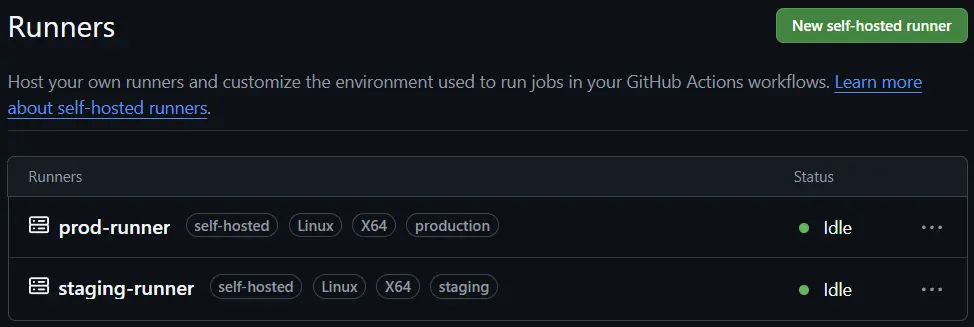

Con eso ya tenemos la primera parte del reto completa, ya tenemos en dónde correr nuestros pipelines y sabemos en qué puertos ver la aplicación en nuestras maquinas

### Planteando los pipelines

Ya con un flujo de docker compose definido y claro ahora lo que necesitamos es empatar todo para que funcione, la parte más sencilla es que el funcionamiento de todos los pipelines serán en Self-hosted runners, para la definición de tareas tenemos de acuerdo al reto:

- GitHub Actions ejecuta CI - [ci.yml](../../.github/workflows/ci.yml)
- Build de imágenes Docker - [ci.yml](../../.github/workflows/ci.yml)
- Auto-deploy a Staging - [deploy-staging](../../.github/workflows/deploy-staging.yml)
- Deploy a Production (con approval manual) - [deploy-staging](../../.github/workflows/deploy-staging.yml)
- Monitoreo continuo - [health-check.yml](../../.github/workflows/health-check.yml)

Uno que vamos a adicionar será la revisión de código en el pull request para determinar si podemos fusionar el código - [pull-request.yml](../../.github/workflows/pull-request.yml)

### Tareas de los flujos

Aunque los nombres son descriptivos debemos tener claro cúal es el orden de ejecución de todo esto, el ejercicio en este caso tiene un orden especifico y es coherente con lo que la industria utiliza en sus procesos CI/CD, al inicio del documento lo puedes ver: [Viaja rápido desde aquí :)](#flujo-cicd), ahora teniendo en cuenta eso vamos a explicar el flujo en orden

### Flujo Pull Request YML

Su propósito principal es determinar si el código es saludable para fusionarse con la rama objetivo, en sus tareas está ejecutar los test de cada módulo de la aplicación, en este caso sería `vote`, `result` y `worker`, se compone de un **job** con tres tareas, en cada tarea monta el entorno especifico para poder ejecutar los respectivos test (**python para Vote** y **Node JS para result y worker**), en caso de que falle algún test este pipeline va a fallar y no dejará continuar con el merge.

### Flujo CI YML

Este workflow lleva la automatización del ciclo de integración y empaquetado de la aplicación. Se ejecuta cada vez que hay un push en las ramas `develop` o `master`, o cuando lo ejecutamos manualmente (por ejemplo, para hacer un build de control).

**¿Qué tareas realiza, en qué orden y por qué se hace así?**

1. **Detectar qué ha cambiado**  
   El primer job (`detect-changes`) examina qué carpetas del proyecto tuvieron cambios. Esto permite construir solo los servicios afectados y ahorrar tiempo y recursos.
   - Usa `dorny/paths-filter` para activar flags sobre `vote`, `result` y `worker` según si se modificó su código fuente.

2. **Build y Push condicional de imágenes Docker**  
   Tres jobs (`build-vote`, `build-result`, `build-worker`) se ejecutan en paralelo pero solo si se detectó cambio en sus respectivos directorios. Cada job:
   - Hace checkout del repo.
   - Hace login en DockerHub usando secrets (seguridad).
   - Detecta con un paso condicional si estamos en `master` o `develop` para poner la etiqueta correcta: `prod` para producción, `staging` para desarrollo.
   - Usa Docker Buildx para armar la imagen multi-arquitectura si es necesario.
   - Construye la imagen Docker y la publica en DockerHub con el tag calculado.

**¿Por qué así?**
- Permite builds mucho más rápidos, ya que sólo se reconstruyen imágenes cuando de verdad hubo modificaciones.
- Garantiza que al final de este workflow siempre tendremos en DockerHub la última imagen lista para ser usada por los ambientes `staging` y/o `production` en los siguientes pipelines.

---

### Flujo Deploy Staging YML

Este workflow se encarga del despliegue automático en el ambiente de **staging** cada vez que un build en CI (con Docker Hub push) fue exitoso sobre la rama `develop`.

**¿Cómo funciona este flujo?**

1. **Disparador automático:**  
   Se ejecuta vía `workflow_run` (un trigger especial de GitHub Actions) cuando se completa satisfactoriamente (`conclusion == 'success'`) el workflow de CI en la rama `develop`.

2. **Despliegue automático en la VM 'staging'**  
   - Se ejecuta siempre en el self-hosted runner etiquetado como `staging`.
   - El job hace checkout del repositorio, se loguea en DockerHub y genera los archivos de entorno requeridos (env y postgres.env usando secrets).
   - Utiliza los archivos de Compose en modo override (`-f docker-compose.yml -f docker-compose.staging.yml -f docker-compose.vagrant.yml`), primero hace pull para traer las nuevas imágenes y luego hace `up -d --remove-orphans` para reconciliar el estado.
   - Finaliza mostrando el estado de los contenedores.

**¿Por qué así?**
- El uso de self-hosted runner en Staging simula un ambiente real y permite tener pipelines rápidos (sin esperar por runners de GitHub).
- El pull+up con override posibilita adaptar el mismo proyecto a diferentes entornos cambiando solo el Compose adecuado.
- Es un deployment 100% automatizado, sin intervención manual, para acelerar el ciclo de validación y pruebas.

---

### Flujo Deploy Production YML

Este workflow orquesta el despliegue controlado en **producción**, con lógica específica de respaldo y notificación.

**¿Cómo y cuándo corre este pipeline?**

1. **Trigger manual y seguro:**  
   Solo se ejecuta con `workflow_dispatch` (trigger manual) y requiere indicar la versión o motivo del despliegue (input).

2. **Respaldo obligado antes de hacer cambios:**  
   - Antes de cualquier cosa, el job hace un backup automático de la base de datos productiva vía `pg_dump` ejecutado dentro del contenedor de PostgreSQL.
   - El dump se extrae y se sube como artefacto para recuperación rápida ante errores o rollbacks.

3. **Deploy seguro y regeneración de archivos de entorno:**  
   - El job baja las nuevas imágenes Docker de DockerHub, recrea los contenedores sobre los archivos de Compose con override igual que en staging, pero ahora aplicando los secretos y configuraciones productivas (.env, postgres.env, etc).
   - Mismo enfoque: asegura que solo cambian los contenedores que realmente tienen imágenes nuevas.

4. **Notificación unificada del deployment:**  
   - Un segundo job, dependiente del principal y siempre ejecutado (`if: always()`), analiza si el despliegue fue exitoso o fallido.
   - Envía mensaje a canal de Slack con color y mensaje adecuado, e incluye un enlace a los logs del workflow.

**¿Por qué así?**
- Garantiza que nunca haremos un deploy sin respaldo previo de la base de datos, modelo profesional.
- Aísla los cambios por entorno y mantiene los pipelines auditables y 100% declarativos.
- La notificación permite intervención rápida si hay cualquier error, alineado con buenas prácticas del monitoreo moderno y operación de servicio.

---

### Salud y monitoreo automático en producción

El workflow `Continuous Health Check` implementa la supervisión activa pos-despliegue.

**¿Qué hace exactamente este job?**
- Se ejecuta cada 30 minutos (schedule) y/o bajo demanda.
- Verifica el endpoint de salud (`/healthz`) del servicio productivo levantado en el self-hosted runner de producción.
- Analiza si el servicio responde y notifica SIEMPRE (sea éxito o alerta crítica) vía Slack.

**¿Por qué esto es fundamental?**
- Asegura visibilidad constante del estado de la aplicación productiva.
- Genera alertas automáticas accionables en tiempo real en el canal del equipo, cerrando el ciclo de DevOps profesional donde monitoreo, observabilidad y notificación cierran la última milla del pipeline.

---

## Instrucciones para configurar GitHub Actions: Secrets y Environments

## 1. ¿Por qué necesitas secrets?

Los secretos ("secrets") en GitHub Actions almacenan información sensible (credenciales, tokens, passwords) de forma segura y solo están disponibles para los workflows autorizados.  
Nunca deben agregarse directamente al código, ni a archivos `.env` en el repositorio.

---

## 2. ¿Qué tipos de secrets hay en un proyecto CI/CD real?

- **Secrets del repositorio:** Son accesibles para cualquier workflow del repo, independientemente del entorno (staging, prod).
- **Secrets por environment:** Estos solo son accesibles para jobs o steps que declaren explícitamente en su configuración que corren en ese environment (por ejemplo, `environment: staging` o `environment: prod`). Son ideales para manejar credenciales y variables que dependen de cada ambiente.

---

## 3. Ejemplo

### a. Repository secrets

Estos los usas para credenciales compartidas en todo el flujo:
- `DOCKERHUB_USERNAME` y `DOCKERHUB_TOKEN`: Necesarios para hacer login y publicar imágenes en Docker Hub.
  - **¿Cómo obtenerlos?**
    - Crea una cuenta en [https://hub.docker.com](https://hub.docker.com).
    - Ve a "Account Settings" > "Security" > "New Access Token", crea un token y cópialo para usarlo en `DOCKERHUB_TOKEN`.
    - Tu username de Docker Hub va en `DOCKERHUB_USERNAME`.
- `SLACK_WEBHOOK_URL` / `SLACK_WEBHOOK_URL_ALERTS`: Webhooks para enviar mensajes automáticos a Slack desde cualquier workflow.
  - **¿Cómo obtenerlos?**
    - En Slack, ve a [https://api.slack.com/apps](https://api.slack.com/apps) y crea una nueva app.
    - Añade el feature "Incoming Webhooks" y activa.
    - Escoge el canal donde quieres recibir las notificaciones, copia la URL y pégala como secret en Github.
  - **¿Cómo crear un nuevo canal?**
    - Haz clic en "+" junto a "Canales" en la barra de Slack, crea uno público o privado según necesidad.

### b. Environment secrets

Aquí defines secretos específicos para `staging` y `prod`.
- Ejemplo: `DATABASE_USER`, `REDIS_HOST`, `POSTGRES_DB`, etc.  
  Cada valor puede y debe ser distinto según el environment, permitiendo separación de credenciales y mayor seguridad.
- **¿Cómo funcionan?**
  - Si declaras en tu workflow:
    ```
    jobs:
      deploy-to-prod:
        environment: prod
    ```
    solo entonces los jobs pueden leer `DATABASE_USER` y compañía definidos en environment `prod`.

---

## 4. ¿Cómo crear secrets y environments en GitHub?

### a. Repository secrets

1. Ve al repo en GitHub > Settings > Secrets and variables > Actions > Secrets.
2. Haz clic en "New repository secret".
3. Ingresa el nombre (todo mayús y guion bajo, sin espacios) y pega el valor.
4. Repite para los que necesites.
   - Ejemplo: `DOCKERHUB_USERNAME`, `DOCKERHUB_TOKEN`, `SLACK_WEBHOOK_URL`

### b. Environments y environment secrets

1. Ve a Settings > Environments.
2. Crea los environments (`staging`, `prod`) si aún no existen.
3. Entra a cada environment, ve a "Secrets" y crea los correspondientes secretos (`DATABASE_USER`, `POSTGRES_DB`, etc).
4. Así aseguras que el mismo secret no está expuesto entre ambientes.

---

## 5. ¿Por qué así?

- **Separación de ambientes:** Puedes hacer deploys a staging con credenciales y datos *totalmente independientes* de producción.
- **Seguridad:** Si por error filtras los secrets de staging, producción sigue segura.
- **Comodidad y automatización:** Los jobs que necesitan credenciales las leen automáticamente si el workflow (y su job) declara el environment correcto.

---

## 6. Ventajas de este enfoque

- Mantienes el principio de menor privilegio: ningún job puede acceder a info de ambientes que no le corresponden.
- Facilitas rotación de claves/secretos para staging y prod de manera aislada.
- Cumples buenas prácticas de DevOps y pipelines modernos.

---

> **TIP:** Nunca subas archivos `.env` reales al repo y siempre borra los tokens después de pruebas. Los secrets de DockerHub y Slack pueden ser rotados periódicamente sin afectar los flujos si actualizas tus secrets en GitHub.

---

## 7. ¿Cómo los vamos a generar?

Nuestra aplicación necesita por defecto cinco variables de entorno, que vemos en el root **(.env.example)** y en **(/app/vote.env.local.example)** que se refieren a

```
REDIS_HOST
DATABASE_HOST
DATABASE_USER
DATABASE_PASSWORD
DATABASE_NAME
```

también tenemos los que va a usar la base de datos que son

```
POSTGRES_USER
POSTGRES_PASSWORD
POSTGRES_DB
```

los puedes encontrar en **(postgres.env.exapmple)**

Esto es lo que nuestra aplicación va a necesitar, pero hace falta lo que va a utilizar el runner para ejecutar todo y aquí tenemos **y esto es general para ambos ambientes** y son

```
// Credenciales de docker para la creación de imagenes
DOCKERHUB_TOKEN
DOCKERHUB_USERNAME
// Conexiones para los avisos de Slack
SLACK_WEBHOOK_URL
SLACK_WEBHOOK_URL_ALERTS
```

## 7.1 Creando los webhooks de Slack

En Slack debes crear la aplicación que se encargue de notificar y eso se hace desde aquí `[Slack Apps](https://api.slack.com/apps)`

Primero debes vincularla a tu workspace de esta manera

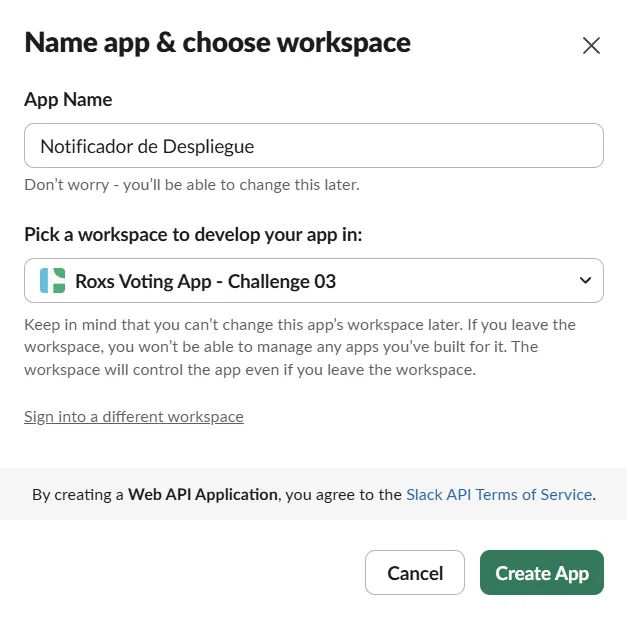

Luego debes habilitar `Incoming Webhooks`

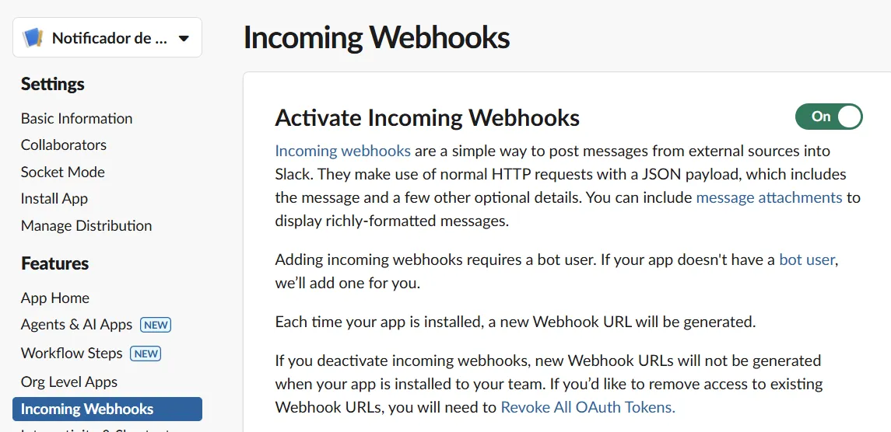

Luego agregas los webhooks que quieras, en este proyecto se tienen dos canales con avisos, uno de deployments y otro de alerts-prod para el status de la app

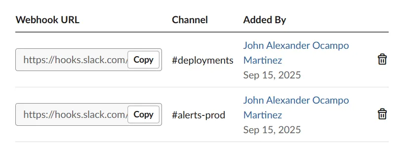

Luego pruebas el webhook con **curl** y el resultado es el siguiente

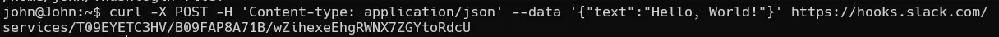

y en el canal debe salir

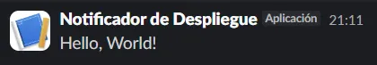

Ahora estas URLs que tenemos en los webhooks van a ser nuestros `Repository Secrets`

## 7.2 Creando PAT en dockerhub

En tu cuenta vas a **configuración**, luego a PAT **(Personal Access Token)**, creas uno con permiso de `read, write, delete` y de aquí necesitamos dos tokens, el primero es tu usuario de dockerhub y el token que generó

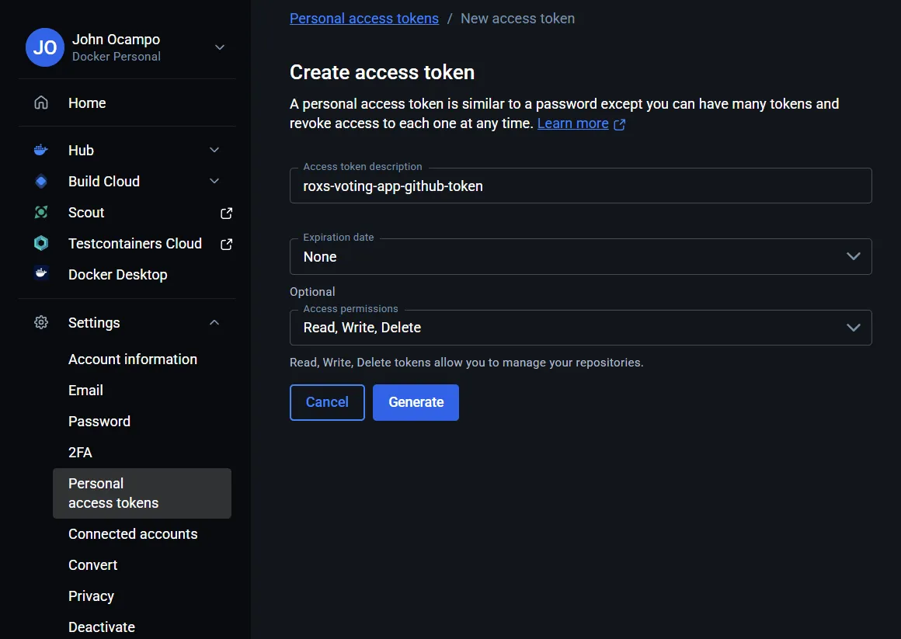

La sección de **Repository Secrets** debe quedar con los siguientes tokens

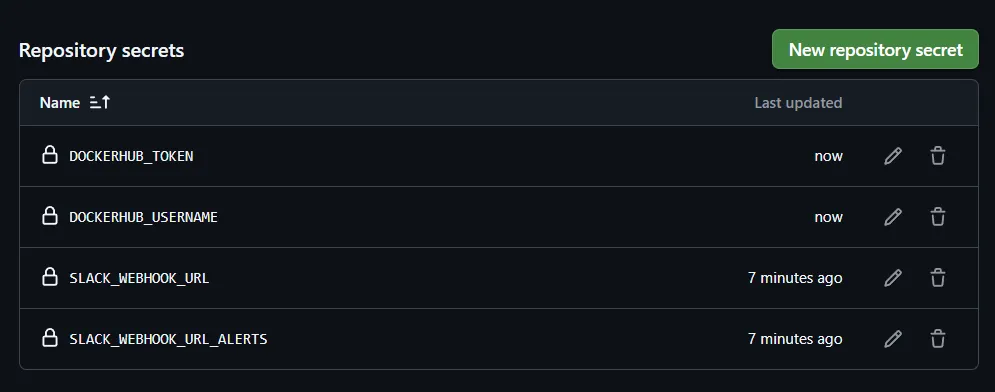

Ahora tenemos todo listo para correr nuestros pipelines y un flujo claro

## 8. Flujo final y solución

Hagamos un repaso de cómo quedó nuestro flujo y viendo cómo vamos superando todo el reto

1. 👨‍💻 Developer hace push a 'develop'

2. 🔄 GitHub Actions ejecuta CI
   - Tests de vote (Python)
   - Tests de result (Node.js) 
   - Tests de worker (Node.js)
   - Integration tests con Docker Compose

Vamos a simular el push con un **Pull Request** ya que no es óptimo hacer el push directamente a la rama sin saber qué se va a subir

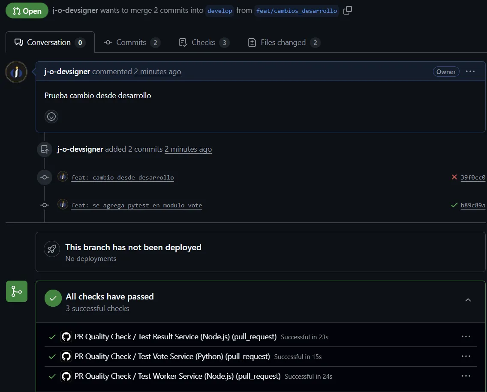

Ahora antes de aprobar los cambios tenemos el check del testing, una vez aprobado podemos seguir con el paso

3. 🏗️ Build de imágenes Docker
   - vote:latest
   - result:latest
   - worker:latest

En este ejercicio manejamos dos ramas principales **master y develop**, todo el ejercicio está hecho para tener dos ambientes homogeneos, uno de producción que es lo que un usuario final va a ver y un ambiente para pruebas que es donde el equipo de desarrollo realiza cambios y agrega nuevas funcionalidades y solo es accesible por el equipo correspondiente, así que en nuestro proceso la rama **master** va a ser nuestra rama de producción y la rama **develop** va a ser nuestra rama de pruebas, así que cuando pasemos entre ambas ramas vamos a crear las imágenes de docker con su respectivo tag **prod y staging**

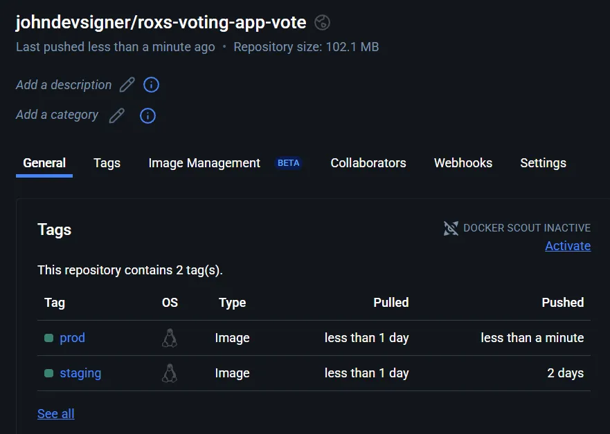

4. 🚀 Auto-deploy a Staging
   - Self-hosted runner ejecuta deployment
   - Health checks verifican que funciona
   - Smoke tests confirman funcionalidad

Para este punto los health checks que tenemos en ambiente **staging** son por parte de **docker compsoe** que fueron implementados en el anterior challenge

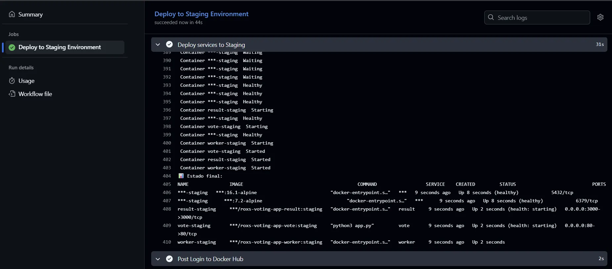

Luego para un smoke test podemos revisar lo desplegado por medio de los puertos que redirigimos a nuestra maquina por medio de Vagrant y asignamos para el ambiente correspondiente

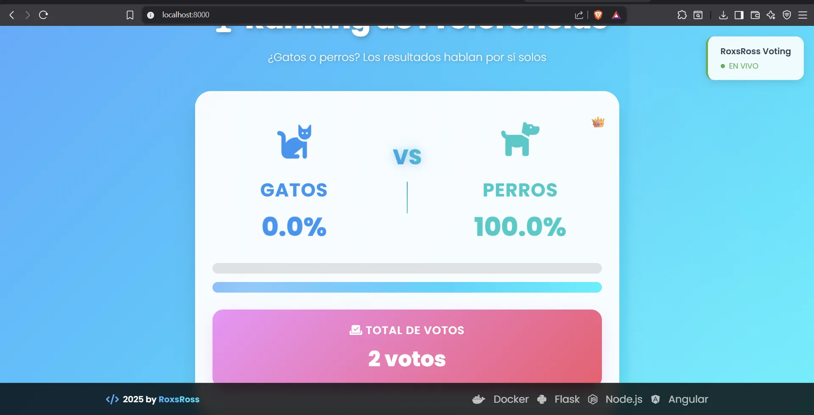

5. 👨‍💻 Developer hace PR a 'main'

6. 👀 Code review y merge

7. 🎯 Deploy a Production (con approval manual)
   - Backup de base de datos
   - Self-hosted runner ejecuta deployment
   - Health checks verifican que funciona
   - Notificación de deployment exitoso

Para tener un approval manual necesitamos una versión paga de GitHub, pero podemos acercarnos utilizando

```
on:
  workflow_dispatch:
    inputs:
      version:
        description: "Versión o motivo del despliegue"
        required: true
        default: "Nuevo despliegue a producción"
```

que funcionará como un disparador manual y vamos a escribir el motivo de despliegue

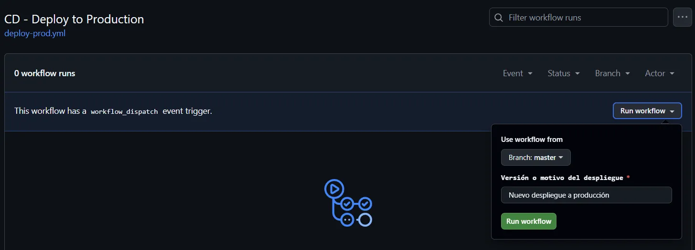

Y en caso de que falle o funcione todo vamos a recibir la notificación en nuestro canal de slack según corresponda **(Solo ambiente producción - master)**

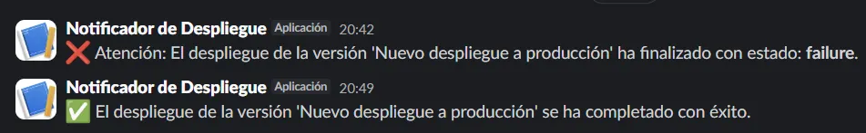

Para el backup de base de datos tenemos la condición de que si no existe la imagen de postgres continue el flujo CI/CD, pero en caso de que haya una base de datos para hacer backup quedará de la siguiente manera

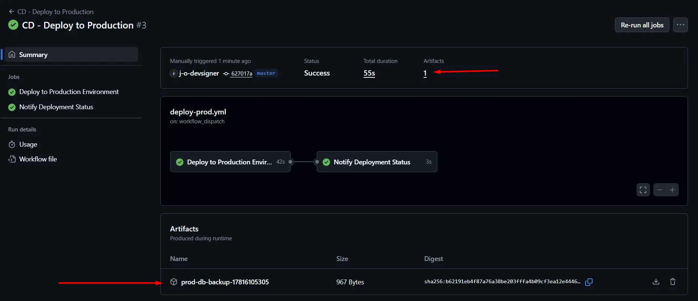

Ahora cómo se usa este **backup**, primero que todo se debe tener instalado `postgresql-client`

Puedes crear una base de datos dummy para probar

```sh
createdb -h <host> -U <usuario> -W recuperada

# Con el archivo descargado de los artefactos
pg_restore -h <host> -U <usuario> -d recuperada -v backup-prod-20250917210000.dump
```

De esta manera se puede replicar la información en una nueva base de datos de manera sencilla


8. 📊 Monitoreo continuo
   - Health checks cada 30 minutos
   - Alertas automáticas si algo falla

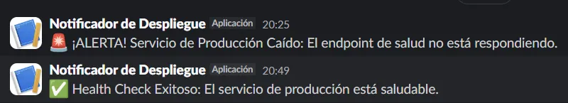

Para los avisos si algo falla tenemos especificamente este health check con temporizador en nuestro workflow [health-check.yml](../../.github/workflows/health-check.yml) cada 30 minutos debe dar un aviso y especificamente este job luego de su primer ejecución debe ejecutarse de manera **programada (scheduled)**, ejemplo

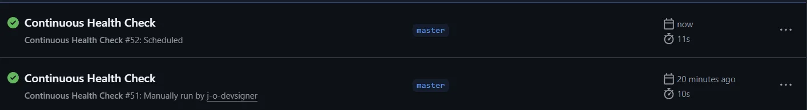

Aquí se ve la diferencia de correr el pipeline **manual y programada**

## Pruebas en distintos ambientes

Ahora con todo el flujo montado, vamos a ver nuestra aplicación en distintos puertos [puedes ver aquí](#2-definiendo-vagrantfile)

Ahora probemos con un cambio en la UI de un componente para ver cómo se comportan ambos ambientes, primero que todo mandamos un cambio para ambiente desarrollo para probar un cambio futuro en nuestra aplicación

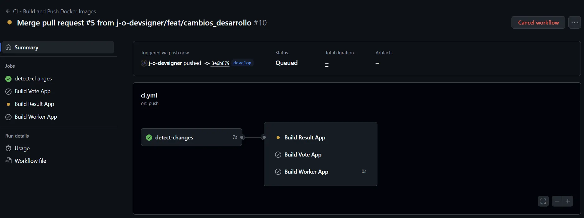

Ahora comprobamos que la construcción de imagnes solo se aplica a los módulos que fueron cambiados y los otros los deja quietos para ahorrar tiempo de ejecución

Lo que notamos es lo siguiente, nuestro cambio se aplicó en el ambiente correspondiente de manera correcta

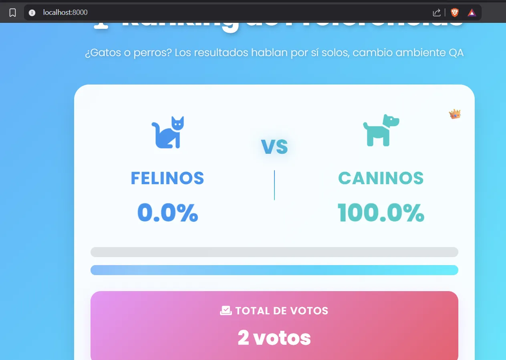

Y adicionalmente nuestro ambiente producción sigue intacto hasta confirmar que vamos a pasar este cambio

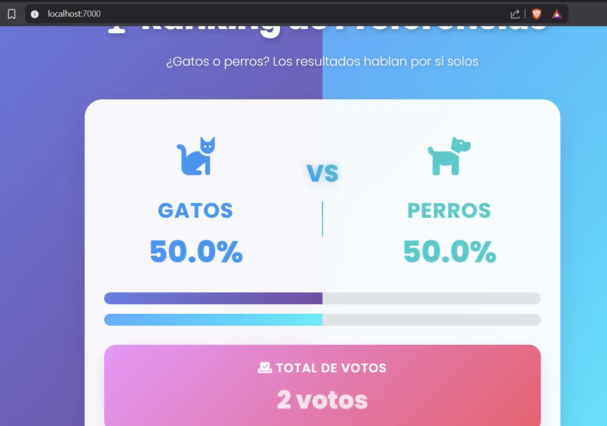

Por último si confirmamos que son los cambios correctos solo queda actualizar el ambiente de producción y basta con un merge entre la rama **develop** y **master**

## Archivos del ejercicio

- Principalmente los workflos puedes verlos [aquí](../../.github/workflows/)
- Archivos docker compose en el root [docker-compose.override](../../docker-compose.override.yml), [docker-compose.prod](../../docker-compose.prod.yml), [docker-compose.staging](../../docker-compose.staging.yml), [docker-compose.vagrant](../../docker-compose.vagrant.yml), [docker-compose](../../docker-compose.yml)
- Vagrantfile para los self-hosted runners [Vagrantfile.runners](../../Vagrantfile.runners)
- Script para provisionar los hosted runners de manera automatica [setup_selfhosted_runner](../../scripts/setup_selfhosted_runner.sh)